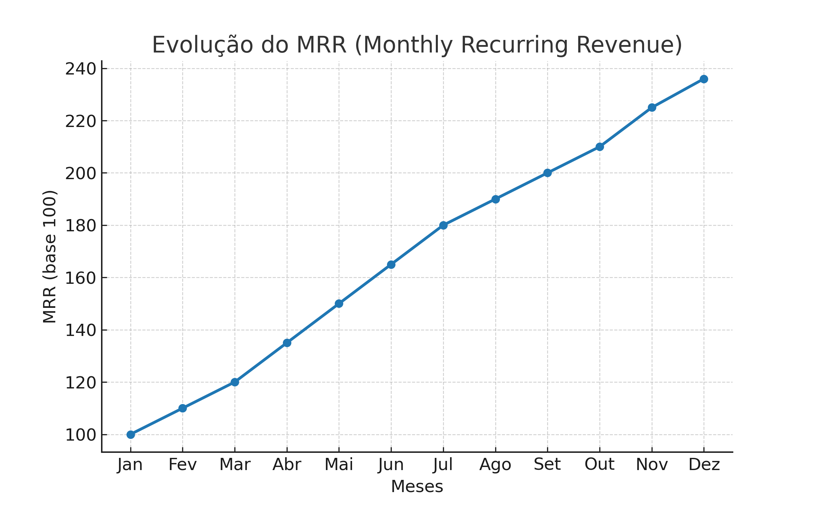
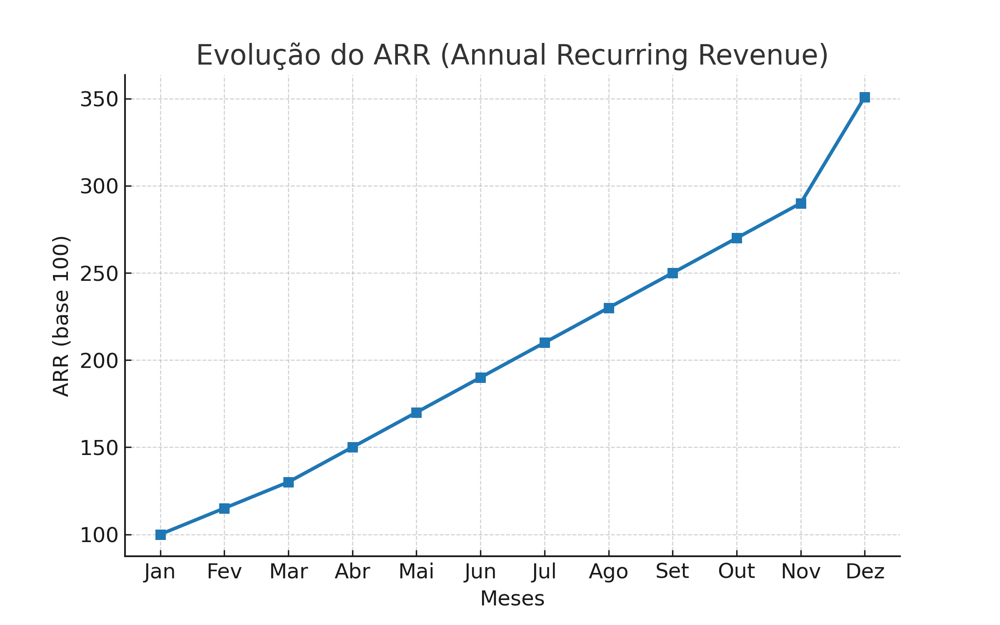
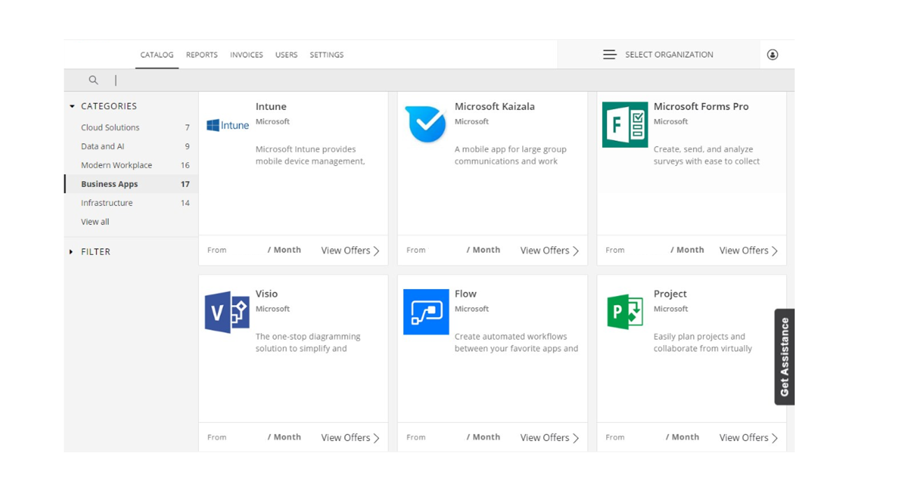

# 🚀 Plataforma Marketplace SaaS + IaaS B2B

Plataforma desenvolvida para gestão, monetização e escalabilidade de softwares e serviços em modelo **Marketplace B2B**, combinando **SaaS** e **IaaS**.  
A iniciativa uniu **estratégias de Growth**, **integrações financeiras** e **automação de billing**, impulsionando métricas críticas de receita e eficiência operacional.

---

## 🎯 Objetivos do Projeto
- Expandir receita recorrente (MRR e ARR) em softwares e serviços.  
- Oferecer uma experiência integrada de marketplace para clientes corporativos.  
- Automatizar conformação, reconciliação e cobrança de assinaturas e consumo de dados.  
- Criar base tecnológica escalável, integrável a múltiplos ERPs e CRMs.

---

## 🛠️ Solução Desenvolvida
- **Marketplace SaaS + IaaS** com gestão de assinaturas, consumo e parceiros.  
- **Middleware de conformação e reconciliação** por ciclo de consumo de dados e billing.  
- Integração robusta com ERP para **faturamento, boletos e relatórios de consumo**.  
- **Estratégias de Product-Led Growth (PLG)** para engajar clientes e acelerar expansão.  
- Arquitetura cloud-native, preparada para escalar em múltiplos clientes B2B.

---

## 📊 Resultados Alcançados
- 📈 **+36% de MRR** (Monthly Recurring Revenue).  
- 💹 **+50% de ARR** (Annual Recurring Revenue) em softwares e serviços.  
- ⚡ **+66% de aceleração no ciclo de cobrança**, via automação e reconciliação integrada.  
- 🔄 Redução de custos operacionais e maior previsibilidade de receita.  
- 🌐 Consolidação de um **ecossistema B2B** integrado para provedores e clientes.

---

## 📊 Resultados Visuais

Evolução do MRR:  

Evolução do ARR:  

---

## 📸 Demonstrações da Plataforma
  
  

---

## 📂 Estrutura do Repositório
- `docs/` → Imagens e diagramas do sistema.  
- `resultados/` → Gráficos de KPIs e métricas (MRR, ARR, etc.).  
- `materiais/` → Apresentações, PDFs e outros documentos de apoio.
## 🖥️ Telas da Plataforma

Tela principal do Marketplace:  

---

## 📌 Observações
Este repositório contém apenas **materiais públicos e ilustrativos**, sem dados confidenciais de clientes ou informações sensíveis.
